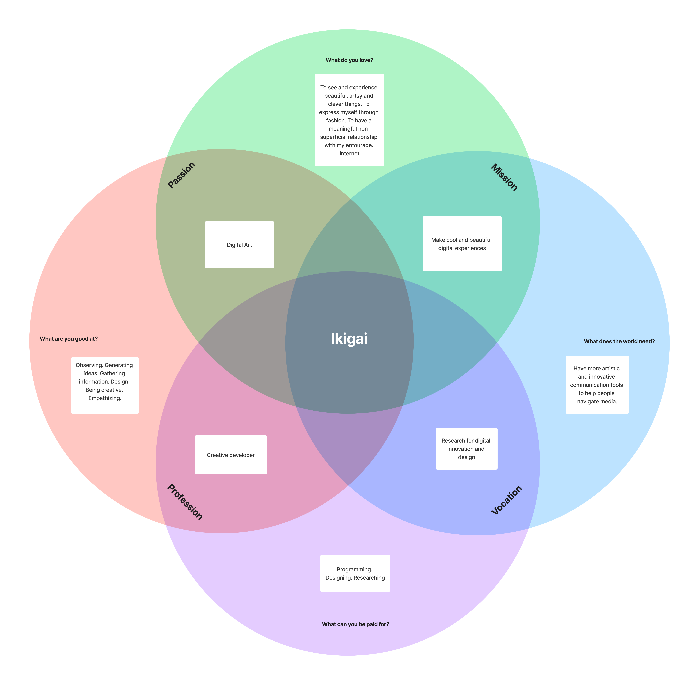

Je suis passionné par les expressions artistiques, comme la mode, la musique et le cinéma, ce qui m'a incité à étudier le graphisme. J'ai découvert l'importance du design dans notre vie quotidienne. J'ai poursuivi mes études en ingénierie des médias et découvert la programmation. J'aime résoudre des problèmes , mais je suis également intéressé par la conception globale de projets numériques, de la recherche à la réalisation technique. Ce qui me pousse dans un premier temps vers le domaine du Cretive Dev. Mon objectif sur le long terme serait de devenir directrice artistique pour de grands projets digitaux.

